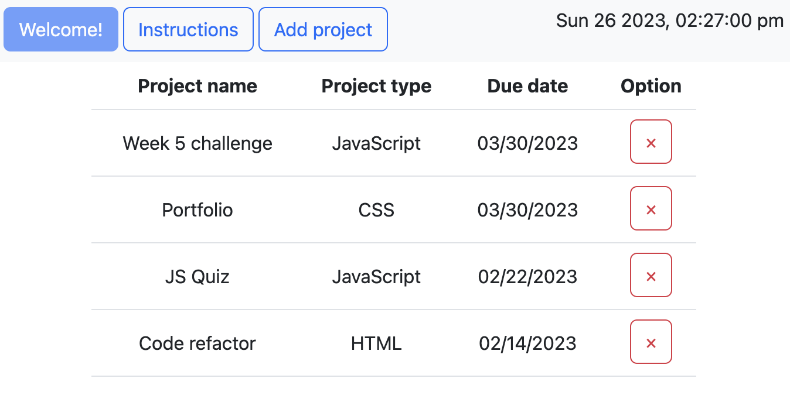

# Descrption
App that helps keep track of project by adding and storing them in localStorage with project name, type and due date. 
User can easily add and remove listed projects using app. 
As a feature, current time is displayed on the page.

# Screenshot

# Used technology
- HTML
- Bootstrap
- JavaScript
- jQuery
- jQuery UI
- day.js

# Link
[Click me](https://abstynent.github.io/project-tracker)